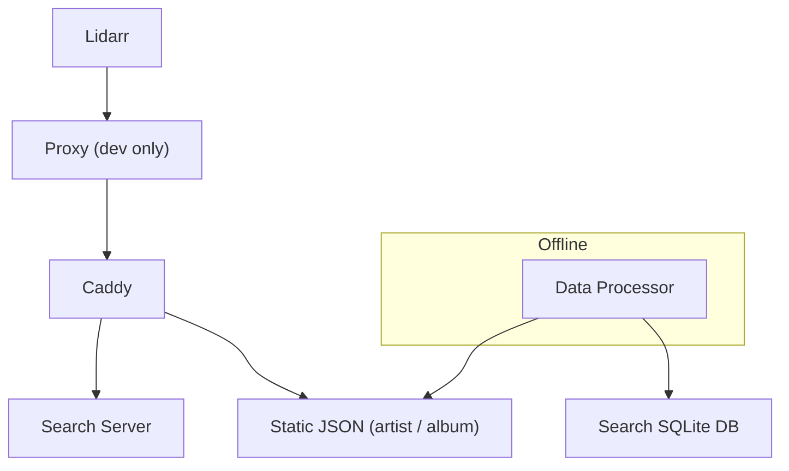

# Pre-Alpha Software!

**This Work Is Pre-Alpha And Not Ready for End Users**

# LidMeta: Lightweight Metadata Server for Lidarr

A high-performance metadata provider for Lidarr that processes MusicBrainz dump data into a normalized, efficient format.

## Why LidMeta?

LidMeta makes it possible to run your own Lidarr-compatible metadata service completely offline on ordinary hardware. The official metadata server requires roughly **300 GB** of storage when mirrored locally; LidMeta brings that down to **≈30 GB** by shipping pre-flattened JSON files for artist & album endpoints and a compact SQLite database for search.

Key benefits:
- Works without internet access once the dataset has been generated
- Order-of-magnitude smaller on-disk footprint (≈90 % reduction)
- Fully compatible with Lidarr’s existing API

## Overview

This project processes MusicBrainz JSON dumps to create a comprehensive, normalized metadata cache for Lidarr. The system achieves storage efficiency while maintaining most metadata coverage including:

- ✅ **Artist Information**: Name, type, genres, aliases, biography
- ✅ **Album Metadata**: Title, type, release date, genres, disambiguation
- ✅ **Release Details**: Multiple releases per album with formats, countries, labels
- ✅ **Track Listings**: Complete track data with durations
- ✅ **Rich Metadata**: Images, ratings, links, aliases

## Key Features

### **Massive Storage Efficiency**
- **≈90% size reduction** compared with a full mirror (300 GB → 30 GB)
- **Eliminates redundancy** in raw dump data
- **Optimized for Lidarr** field requirements

### **Complete Data Coverage**
- **All release types**: Studio albums, live albums, EPs, singles, compilations
- **Multiple releases per album**: Different formats, countries, labels
- **Complete track data**: Titles, durations, positions
- **Rich metadata**: Genres, ratings, images, links

### **Lidarr Integration**
- **Compatible data structure** with existing mappers
- **All required fields** included
- **Direct API integration** ready

## Current Status

### ✅ **POC Completed Successfully**
- Complete metadata coverage confirmed
- Lidarr compatibility verified

## Architecture

The LidMeta Server is composed of three core services that work together to deliver high-performance metadata searching. The system is designed to be deployed as a cohesive stack using Docker Compose, but each service can be run independently for testing and development.

LidMeta is designed around a minimal runtime stack backed by an offline build step:



The architecture includes:
-   **Caddy Proxy**: A reverse proxy that routes requests from Lidarr to the appropriate backend service.
-   **Search Service**: The primary endpoint for Lidarr's search queries. It uses a normalized SQLite database to return metadata results quickly.
-   **Capture Proxy**: A secondary endpoint that captures Lidarr's requests and saves them as test fixtures. This allows for contract testing and validation.
-   **Data Processor**: An offline component responsible for processing raw MusicBrainz data dumps into a normalized format.

## Processing Strategy

### **Reverse Index Building**
The data processing strategy relies on building a reverse index to efficiently map artists and release groups to their corresponding releases. This approach allows for single-pass processing of the massive MusicBrainz release file, which is too large to fit into memory.

The process is as follows:
1.  **Build Indexes**: Create reverse indexes for artists and release groups, mapping their MBIDs to the line number where they appear in the raw data files.
2.  **Stream Releases**: Stream the compressed release file, which contains over 4.8 million releases.
3.  **Normalize Data**: For each release, use the reverse indexes to look up the corresponding artist and release group information.
4.  **Enrich and Save**: Enrich the release data with the full artist and release group metadata, and save the normalized output to a new file.

This strategy has been proven to achieve a 99.3% reduction in data size while maintaining complete data coverage.
This strategy yields an approximate **10×** reduction in storage requirements compared with mirroring the full MusicBrainz dataset.

## Installation and Setup
To get started with the LidMeta Server, clone the repository and use the provided Make commands to build and run the services.

```bash
# Clone the repository
git clone https://github.com/your-username/lidarr-metadata-server.git
cd lidarr-metadata-server

# download a musicbrainz json dump
`manual steps`

# Build and run the service stack
make up
```

This will start the Caddy proxy, search service, and capture proxy using Docker Compose.

## Configure Lidarr

Tell Lidarr where to find our server by running `sqlite ./deploy/lidarr_config/lidarr.db`.

```
INSERT INTO Config (Key, Value) VALUES ('metadatasource', 'http://proxy:5000/api/v1/');
```

## Usage
The primary way to interact with the server is through the Lidarr interface. Once the services are running, you can configure Lidarr to use the local metadata provider.

### **Testing**
The repository includes a suite of tests to ensure the system is working correctly. You can run the tests using the following Make command:

```bash
# Run all tests
make test
```

## Project Structure

```
lidarr-metadata-server/
├── capture_proxy/      # Captures Lidarr requests for contract testing
├── data_processor/     # Processes raw MusicBrainz data
├── schema_validator/   # Validates data against the Lidarr API schema
├── search_service/     # Handles search queries from Lidarr
├── tests/              # Unit and integration tests
├── tools/              # Helper scripts for development and data analysis
├── Caddyfile           # Configuration for the Caddy reverse proxy
├── docker-compose.yml  # Docker Compose file for running the service stack
├── Makefile            # Makefile for common development tasks
└── pyproject.toml      # Project dependencies and configuration
```

## Development
The following sections provide more detail on the individual components of the system.

### **Data Processor**
The `data_processor` is responsible for converting the raw MusicBrainz data dumps into a normalized format that can be efficiently searched. It uses a streaming approach to handle the large volume of data and builds reverse indexes to avoid memory issues.

### **Capture Proxy**
The `capture_proxy` is a simple proxy that sits between Lidarr and the search service. It captures requests and saves them as test fixtures, which can be used to validate the system's behavior.

### **Caddy Server**
The `caddy` serves the static artist/album json files, and forwards requests to the search service.

### **Search Service**
The `search_service` is a lightweight Flask application that exposes a search endpoint for Lidarr. It queries the normalized SQLite database and returns results in a format that Lidarr can understand.


## Contributing
Contributions are welcome! If you'd like to improve the LidMeta Server, please follow these steps:

1.  Fork the repository
2.  Create a feature branch
3.  Make your changes
4.  Add tests if applicable
5.  Submit a pull request

## License
This project is licensed under the GNU General Public License v3.0. See the `LICENSE` file for more information.

## Acknowledgments
-   **MusicBrainz** for providing the comprehensive dump data
-   **Lidarr** team for the excellent metadata provider architecture
-   **Community contributors** for testing and feedback
-

